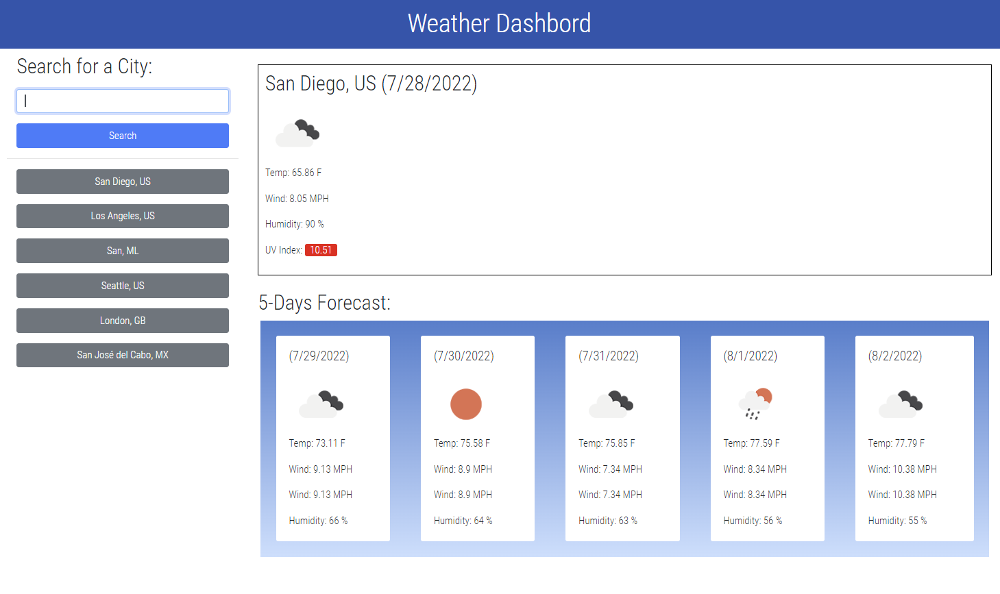

# Weather Dashboard

We develop a weather application using a third-party API which has an HTML and CSS dynamically updated.

## Application functionality.

* The dashboard allows you find, by city name, the current weather and shows you the forecast for the next 5 days.
  
* As you are going looking for differents cities, an small history is being created. 

* You can click a city name in the history, and the forecast will be display again.

* It uses local storage so if you close/update the page the cities you alreday check will be there.

* The UV Index has a different color to show the conditions.

## Mock Up

## The work

* DOM access and manipulation

    * Creating and deleting elements dynamically
  
* Use of local storage and JSON

* Bootstrap to style

* Calls to an API

    * And learning how to use it through the documentation
  
## Techs

* Html

* CSS

* Javascript

* Bootstrap

* Google Fonts

* OpenWeather API

## Link to the application

* [Check the weather here!](https://qgtere.github.io/)